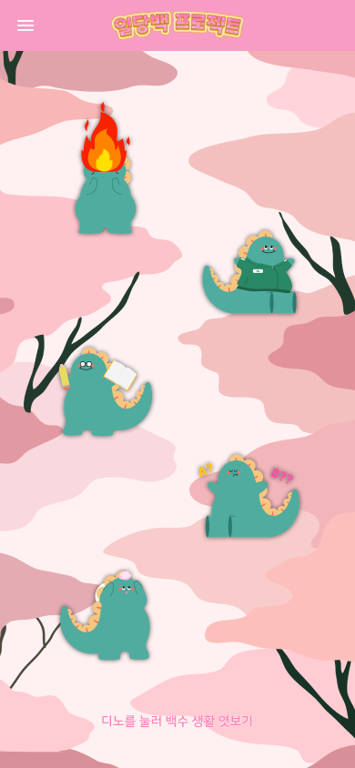
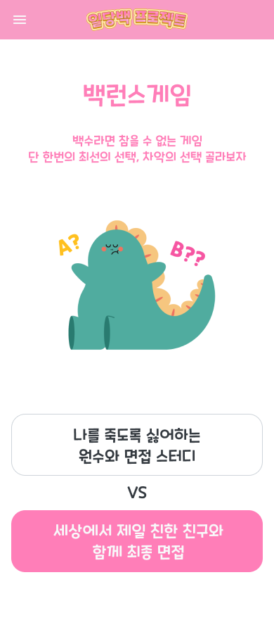
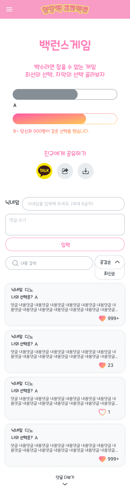
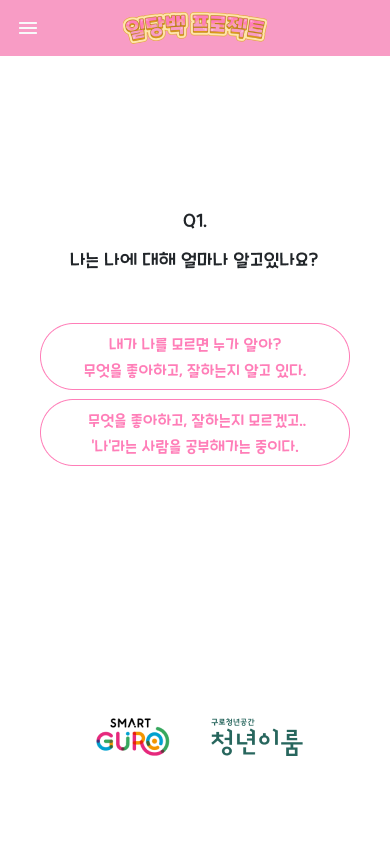
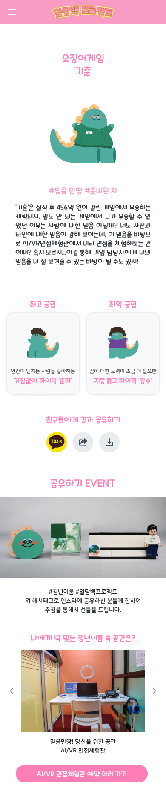
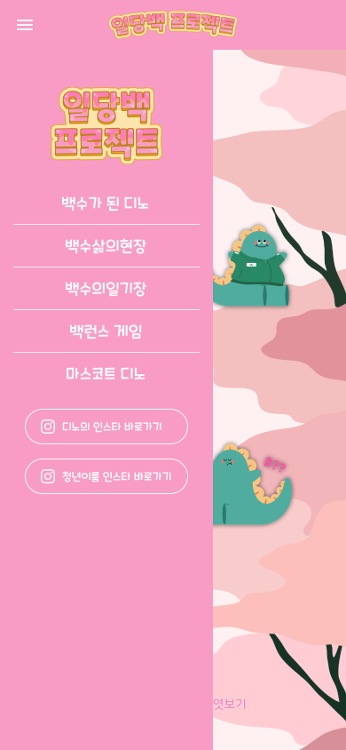
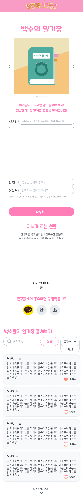
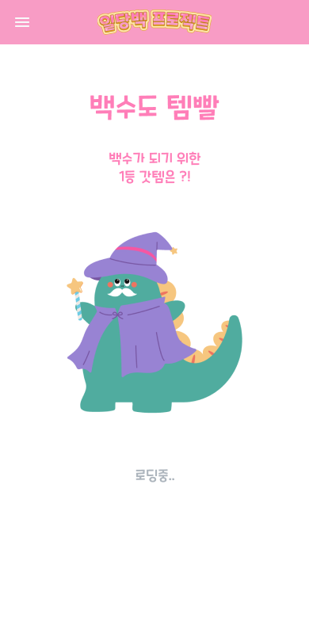

# 🧩 구로 청년 이룸: 일당백 웹사이트

> 청년 커뮤니티 활성화를 위한 이벤트 기반 반응형 웹 프로젝트

---

## 🗓 프로젝트 개요
- **기간**: 2022.04.02 ~ 2022.05.21
- **기여도**: 프론트엔드 100% 
- **참여 인원**: 프론트 1명 / 백엔드 1명 / 디자이너 1명 / 마케터 2명

---

## 🧰 기술 스택
- **Frontend**: React.js, HTML/CSS
- **Design**: Figma
- **Analytics**: Google Analytics(GA)
- **Deploy**: Netlify

---

## 🎯 주요 기능
| 기능             | 설명                                                |
|------------------|-----------------------------------------------------|
| 밸런스 게임        | 주제에 따라 양자택일 선택지 제공, 시각적 피드백 포함     |
| 심리테스트         | 청년 취향에 맞는 유형 테스트 (결과 공유형)               |
| 일기장            | 오늘의 상태/기분/목표 등 기록 기능                     |
| 댓글 기능         | 심리테스트 및 일기장 결과에 대한 자유로운 피드백        |
| GA 태깅 분석      | 사용자 이동 경로 및 클릭 수 추적 분석용 GA 코드 삽입     |

---

## 📸 대표 화면

| 홈 화면 | 밸런스 게임 | 밸런스 게임 결과 | 심리테스트 질문 | 심리테스트 결과 |
|---------|-------------|------------------|------------------|-----------------|
|  |  |  |  |  |

| 메뉴 클릭 | 일기장 | 로딩 화면 |
|------------|--------|------------|
|  |  |  |

---

## 🎖 프로젝트 성과 및 회고
- 반응형 UI/UX에 대한 이해를 높였고, 모바일 중심으로 레이아웃을 설계함
- GA 태깅으로 사용자 흐름을 정량 분석하며 실제 마케팅 데이터를 도출
- 이벤트 기반 웹에서 사용자의 몰입을 이끄는 흐름 설계에 자신감 얻음
- **구로 청년 이룸 프로그램 내 전체 팀 중 1등** 🥇

---

## 📁 GitHub
[일당백 Repository](https://github.com/feedmina/hardcarry2_team3)
