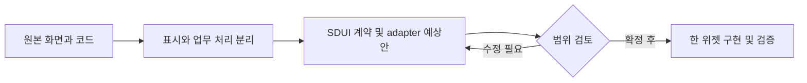

# hardcarry2_team3 — SDUI 위젯 후보

목표: 원래 화면의 역할과 코드를 확인하고, 한 위젯씩 분리할 대상을 정한다. 기준: `master` / `a574b5efc243e90ea44be1e14028f4b44b182c30`.

현재 frontend 진입은 게임·일기 라우트다. 상품 투표 폴더와 백엔드는 있으나 현재 라우트 연결·데이터 공급자가 달라 완성 기능으로 묶지 않는다.

공개 범위: 공개. 선언된 라이선스 미확인: 상용 재사용 전 본인·공동 기여자·이미지 권리 확인. 후보는 구현 완료나 재배포 허가를 의미하지 않는다.

9/18·19·20 KST 커밋 수: 5 / 1 / 0. 병합·문서 커밋 포함; 기능 수 아님. 일요일은 조사 시점까지만.

|ID|위젯 후보|현재 상태|분리 작업|
|---|---|---|---|
|R11-W01|게시글 목록·검색·정렬|조회 소스 있음 / sort 누락 응답 분기 없음|sort 기본값/오류 정책, pageSize 상한, UI 데이터 어댑터; 검색·정렬 UI는 새로 연결하는 제안|
|R11-W02|두 선택지 게임 카드|실제 /game 라우트 연결 있음 / 요청 인자 불일치|onClick("A")에 두번째 balance_type 미전달 문제; 선택 emit만 공통화 후 서버 어댑터|
|R11-W03|상품 선택·투표 카드|컴포넌트 소스 있음 / 현재 Main 라우트 미연결|데이터 공급자 하나로 정리, 정식 POST·중복방지·선택 ID 전달 계약; MIMO 카드 외형만 공통화|

## R11-W01 · 게시글 목록·검색·정렬

글 목록을 최신/인기와 검색어로 조회하는 위젯 후보다.

|항목|내용|
|---|---|
|입력|page,size,sort,keyword|
|처리|DiaryList.getData는 keyword 빈값·sort latest 고정으로 요청; 서버 getDiary는 latest/popular 및 검색 지원, getPagingData가 페이지 수 계산|
|반환·화면|totalItems,diaryList,totalPages,currentPage|
|API|GET /api/diary/getDiary|
|저장|back_diary: content,date,like|
|부수효과|DB 읽기; 좋아요·작성은 별도 쓰기 기능|
|보안·분리 경계|일기 내용과 작성자·연락처 수집을 분리; 고객별 필터와 서버 권한 검토|
|공통화 계열|paged-feed|
|구현 후 통과 기준|sort 없음/latest/popular, 빈 검색, 페이지 끝, DB 오류; 운영 DB 미실행|

핵심 코드:
- [const getData · frontend/src/component/Write/DiaryList.jsx:61](https://github.com/feed-mina/hardcarry2_team3/blob/a574b5efc243e90ea44be1e14028f4b44b182c30/frontend/src/component/Write/DiaryList.jsx#L61)
- [const getDiary · backend/controllers/back-diary.js:91](https://github.com/feed-mina/hardcarry2_team3/blob/a574b5efc243e90ea44be1e14028f4b44b182c30/backend/controllers/back-diary.js#L91)
- [router.get('/getDiary' · backend/routes/api/diary.js:12](https://github.com/feed-mina/hardcarry2_team3/blob/a574b5efc243e90ea44be1e14028f4b44b182c30/backend/routes/api/diary.js#L12)

## R11-W02 · 두 선택지 게임 카드

두 문구 중 하나를 선택하고 결과 화면으로 이동한다.

|항목|내용|
|---|---|
|입력|두 선택 문구,선택값 0/1|
|처리|Game onClick 요청과 onNumberClick 쿠키 저장·navigate가 각각 실행|
|반환·화면|선택 결과 라우트와 쿠키 상태|
|API|GET /api/balance/selectBalance?balance_type=…|
|저장|브라우저 cookie; 서버 연결은 별도|
|부수효과|HTTP 요청·쿠키·페이지 이동|
|보안·분리 경계|임베드 위젯은 쿠키 대신 emit, 하드코딩 HTTP 주소 제거; 쓰기라면 GET 사용 재검토|
|공통화 계열|choice-card|
|구현 후 통과 기준|A/B 선택값 요청 일치·중복 클릭·서버 실패 시 이동 정책 검증 필요|

핵심 코드:
- [const onClick · frontend/src/component/Game/Game.jsx:17](https://github.com/feed-mina/hardcarry2_team3/blob/a574b5efc243e90ea44be1e14028f4b44b182c30/frontend/src/component/Game/Game.jsx#L17)
- [const onNumberClick · frontend/src/component/Game/Game.jsx:36](https://github.com/feed-mina/hardcarry2_team3/blob/a574b5efc243e90ea44be1e14028f4b44b182c30/frontend/src/component/Game/Game.jsx#L36)
- [path="/game" · frontend/src/Main.jsx:44](https://github.com/feed-mina/hardcarry2_team3/blob/a574b5efc243e90ea44be1e14028f4b44b182c30/frontend/src/Main.jsx#L44)

## R11-W03 · 상품 선택·투표 카드

상품 카드에 단일 선택 입력을 붙이는 후보이며 현재 투표 완성품은 아니다.

|항목|내용|
|---|---|
|입력|상품 title,imgUrl,content,id; 선택 항목|
|처리|ProductList는 Firebase 목록을 로드하고 radio 클릭 시 로컬 select 배열 변경; Express voteItems와 직접 연결 확인 안 됨|
|반환·화면|상품 선택 UI; 제안 selectedId 이벤트|
|API|UI GET Firebase /itmes.json; 별도 서버 GET /api/item/voteItems|
|저장|Firebase 상품; 별도 back_item/back_item_vote|
|부수효과|현재 UI는 로컬 선택, 별도 서버는 카운터·IP/브라우저 기록 쓰기|
|보안·분리 경계|UI와 투표 저장 분리; 중복투표·개인정보·GET 쓰기 수정 필요|
|공통화 계열|catalog-card|
|구현 후 통과 기준|현행 활성 화면이라고 표현하지 않음. 선택ID·0표 결과·중복투표·실패 복구 테스트 필요|

핵심 코드:
- [const ProductList = · frontend/src/component/ProductVote/ProductList.jsx:33](https://github.com/feed-mina/hardcarry2_team3/blob/a574b5efc243e90ea44be1e14028f4b44b182c30/frontend/src/component/ProductVote/ProductList.jsx#L33)
- [const voteItems · backend/controllers/back-item.js:22](https://github.com/feed-mina/hardcarry2_team3/blob/a574b5efc243e90ea44be1e14028f4b44b182c30/backend/controllers/back-item.js#L22)
- [function Main · frontend/src/Main.jsx:26](https://github.com/feed-mina/hardcarry2_team3/blob/a574b5efc243e90ea44be1e14028f4b44b182c30/frontend/src/Main.jsx#L26)

## 예상 작업 순서

이번 조사: 정적 소스 확인. 앱 실행·운영 API·실제 고객 화면 동등성은 검증하지 않았다. 위 흐름은 향후 작업 계획이며 현재 앱 호출 흐름이 아니다.

---

## 화면에서 코드를 따라 읽기

화면 동작 → 처리 코드 → 요청·저장 → 반환과 부수효과 → 수정·검증 순서로 읽는다. UI가 없는 후보는 표시 화면을 새로 만드는 제안이다. 이 문서는 기존 조사 SHA를 기준으로 재구성했으며 최신 앱 실행 검증이 아니다.

### R11-W01 · 게시글 목록·검색·정렬

글 목록을 최신/인기와 검색어로 조회하는 위젯 후보다.

**현재 상태:** 조회 소스 있음 / sort 누락 응답 분기 없음

|화면·코드 연결|확인 내용|
|---|---|
|화면에 나오는 결과|totalItems,diaryList,totalPages,currentPage|
|화면이 받는 값|page,size,sort,keyword|
|담당 로직|DiaryList.getData는 keyword 빈값·sort latest 고정으로 요청; 서버 getDiary는 latest/popular 및 검색 지원, getPagingData가 페이지 수 계산|
|요청 창구|GET /api/diary/getDiary|
|저장소 경계|back_diary: content,date,like|
|반환과 별도인 동작|DB 읽기; 좋아요·작성은 별도 쓰기 기능|

**핵심 파일의 확인 지점**

- [const getData](https://github.com/feed-mina/hardcarry2_team3/blob/a574b5efc243e90ea44be1e14028f4b44b182c30/frontend/src/component/Write/DiaryList.jsx#L61) — `frontend/src/component/Write/DiaryList.jsx`에서 이 기능의 선언·호출·계약을 확인한다. 코드 링크는 원래 조사 SHA에 고정되어 있다.
- [const getDiary](https://github.com/feed-mina/hardcarry2_team3/blob/a574b5efc243e90ea44be1e14028f4b44b182c30/backend/controllers/back-diary.js#L91) — `backend/controllers/back-diary.js`에서 이 기능의 선언·호출·계약을 확인한다. 코드 링크는 원래 조사 SHA에 고정되어 있다.
- [router.get('/getDiary'](https://github.com/feed-mina/hardcarry2_team3/blob/a574b5efc243e90ea44be1e14028f4b44b182c30/backend/routes/api/diary.js#L12) — `backend/routes/api/diary.js`에서 이 기능의 선언·호출·계약을 확인한다. 코드 링크는 원래 조사 SHA에 고정되어 있다.

**유지보수 시 변경할 범위:** sort 기본값/오류 정책, pageSize 상한, UI 데이터 어댑터; 검색·정렬 UI는 새로 연결하는 제안
**보안·공통화 경계:** 일기 내용과 작성자·연락처 수집을 분리; 고객별 필터와 서버 권한 검토
**회귀 확인:** sort 없음/latest/popular, 빈 검색, 페이지 끝, DB 오류; 운영 DB 미실행

### R11-W02 · 두 선택지 게임 카드

두 문구 중 하나를 선택하고 결과 화면으로 이동한다.

**현재 상태:** 실제 /game 라우트 연결 있음 / 요청 인자 불일치

|화면·코드 연결|확인 내용|
|---|---|
|화면에 나오는 결과|선택 결과 라우트와 쿠키 상태|
|화면이 받는 값|두 선택 문구,선택값 0/1|
|담당 로직|Game onClick 요청과 onNumberClick 쿠키 저장·navigate가 각각 실행|
|요청 창구|GET /api/balance/selectBalance?balance_type=…|
|저장소 경계|브라우저 cookie; 서버 연결은 별도|
|반환과 별도인 동작|HTTP 요청·쿠키·페이지 이동|

**핵심 파일의 확인 지점**

- [const onClick](https://github.com/feed-mina/hardcarry2_team3/blob/a574b5efc243e90ea44be1e14028f4b44b182c30/frontend/src/component/Game/Game.jsx#L17) — `frontend/src/component/Game/Game.jsx`에서 이 기능의 선언·호출·계약을 확인한다. 코드 링크는 원래 조사 SHA에 고정되어 있다.
- [const onNumberClick](https://github.com/feed-mina/hardcarry2_team3/blob/a574b5efc243e90ea44be1e14028f4b44b182c30/frontend/src/component/Game/Game.jsx#L36) — `frontend/src/component/Game/Game.jsx`에서 이 기능의 선언·호출·계약을 확인한다. 코드 링크는 원래 조사 SHA에 고정되어 있다.
- [path="/game"](https://github.com/feed-mina/hardcarry2_team3/blob/a574b5efc243e90ea44be1e14028f4b44b182c30/frontend/src/Main.jsx#L44) — `frontend/src/Main.jsx`에서 이 기능의 선언·호출·계약을 확인한다. 코드 링크는 원래 조사 SHA에 고정되어 있다.

**유지보수 시 변경할 범위:** onClick("A")에 두번째 balance_type 미전달 문제; 선택 emit만 공통화 후 서버 어댑터
**보안·공통화 경계:** 임베드 위젯은 쿠키 대신 emit, 하드코딩 HTTP 주소 제거; 쓰기라면 GET 사용 재검토
**회귀 확인:** A/B 선택값 요청 일치·중복 클릭·서버 실패 시 이동 정책 검증 필요

### R11-W03 · 상품 선택·투표 카드

상품 카드에 단일 선택 입력을 붙이는 후보이며 현재 투표 완성품은 아니다.

**현재 상태:** 컴포넌트 소스 있음 / 현재 Main 라우트 미연결

|화면·코드 연결|확인 내용|
|---|---|
|화면에 나오는 결과|상품 선택 UI; 제안 selectedId 이벤트|
|화면이 받는 값|상품 title,imgUrl,content,id; 선택 항목|
|담당 로직|ProductList는 Firebase 목록을 로드하고 radio 클릭 시 로컬 select 배열 변경; Express voteItems와 직접 연결 확인 안 됨|
|요청 창구|UI GET Firebase /itmes.json; 별도 서버 GET /api/item/voteItems|
|저장소 경계|Firebase 상품; 별도 back_item/back_item_vote|
|반환과 별도인 동작|현재 UI는 로컬 선택, 별도 서버는 카운터·IP/브라우저 기록 쓰기|

**핵심 파일의 확인 지점**

- [const ProductList =](https://github.com/feed-mina/hardcarry2_team3/blob/a574b5efc243e90ea44be1e14028f4b44b182c30/frontend/src/component/ProductVote/ProductList.jsx#L33) — `frontend/src/component/ProductVote/ProductList.jsx`에서 이 기능의 선언·호출·계약을 확인한다. 코드 링크는 원래 조사 SHA에 고정되어 있다.
- [const voteItems](https://github.com/feed-mina/hardcarry2_team3/blob/a574b5efc243e90ea44be1e14028f4b44b182c30/backend/controllers/back-item.js#L22) — `backend/controllers/back-item.js`에서 이 기능의 선언·호출·계약을 확인한다. 코드 링크는 원래 조사 SHA에 고정되어 있다.
- [function Main](https://github.com/feed-mina/hardcarry2_team3/blob/a574b5efc243e90ea44be1e14028f4b44b182c30/frontend/src/Main.jsx#L26) — `frontend/src/Main.jsx`에서 이 기능의 선언·호출·계약을 확인한다. 코드 링크는 원래 조사 SHA에 고정되어 있다.

**유지보수 시 변경할 범위:** 데이터 공급자 하나로 정리, 정식 POST·중복방지·선택 ID 전달 계약; MIMO 카드 외형만 공통화
**보안·공통화 경계:** UI와 투표 저장 분리; 중복투표·개인정보·GET 쓰기 수정 필요
**회귀 확인:** 현행 활성 화면이라고 표현하지 않음. 선택ID·0표 결과·중복투표·실패 복구 테스트 필요
