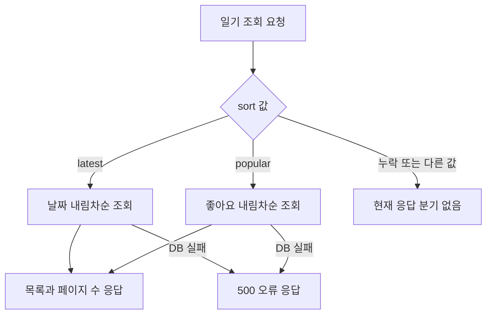

# hardcarry2_team3 — screen-code-handover 업데이트 인수인계

한국시간 2026년 9월 18~19일 업데이트 보고서. 활동 집계 마감은 9월 19일 21:24:15입니다.

게임·투표·일기 기능을 가진 React·Express 프로젝트입니다. 이번 기간에는 화면·서버·DB를 연결한 PDF와 HTML 인수인계 문서가 추가됐습니다.

| 항목 | 기준 |
|---|---|
| 보고서 범위 | 이번 기간의 변경과 관련 기능. 전체 시스템 설명은 아래 기존 상세 문서로 연결합니다. |
| 확인 브랜치 | master |
| 소스 기준 | `0ab83bc3b10e` |
| 검증 범위 | 모의 DB 분리 검사: sort 생략은 조회 0회·응답 0회, latest는 조회 1회·응답 1회였습니다. |
| 보고서 세트 | [쉬운 설명](easy-guide.md) · [수정·검증 지시](fix-guide.md) · [코드 인수인계](screen-code-handover.md) |

## 이번 변경의 경계

- 9월 18일 19:29, PR #1이 master에 병합됐습니다.
- 작업 도중 저장된 PDF와 HTML 수정 커밋을 하나의 문서 제작 작업으로 묶었습니다. 실제 앱 기능이 다섯 번 추가된 것으로 세지 않습니다.

이번 업데이트의 핵심은 문서·계약·서버 처리입니다. 실행 화면을 새로 캡처하지 않았으며 확인하지 않은 화면을 실제 실행 결과로 제시하지 않습니다.

## 핵심 파일과 역할

| 핵심 파일 | 함수·컴포넌트 | 담당 역할 |
|---|---|---|
| [backend/routes/api/diary.js](https://github.com/feed-mina/hardcarry2_team3/blob/0ab83bc3b10e796f95a038cc076ae5b13ede1b6f/backend/routes/api/diary.js) | 라우터 | getDiary·createDiary·diaryLike 요청을 담당 함수에 연결합니다. |
| [backend/controllers/back-diary.js](https://github.com/feed-mina/hardcarry2_team3/blob/0ab83bc3b10e796f95a038cc076ae5b13ede1b6f/backend/controllers/back-diary.js) | getDiary / getPagination / getPagingData | 정렬·검색·쪽 나누기를 적용해 일기 목록을 응답합니다. 정렬값이 허용 두 값과 다르면 응답 분기에 들어가지 않습니다. |
| [backend/sql/schema.sql](https://github.com/feed-mina/hardcarry2_team3/blob/0ab83bc3b10e796f95a038cc076ae5b13ede1b6f/backend/sql/schema.sql) | 테이블 정의 | 일기·좋아요·참여 정보의 저장 구조를 정의합니다. 운영 적용 상태는 별도 확인합니다. |

## 입력·처리·반환과 부수 효과

| 담당 기능 | 입력 | 처리와 분기 | 반환·출력 | 별도로 일어나는 변경 |
|---|---|---|---|---|
| getPagination | page,size | 기본 limit=3, offset=page×limit | {limit,offset} | 없음 |
| getDiary | query.page,size,sort,keyword | latest/popular에 따라 findAndCountAll | HTTP 목록 응답 | DB 조회 |
| getPagingData | count,rows,page,limit | 전체 페이지 수 계산 | {totalItems,diaryList,totalPages,currentPage} | 없음 |

## 동작 흐름

화살표는 호출·데이터 전달 또는 조건 분기를 뜻합니다. 도식에 없는 운영 연결은 확인되지 않았습니다.

## 데이터와 연결 관계

| 저장·전달 대상 | 주요 값 | 관계와 주의점 |
|---|---|---|
| back_diary | diary_id,diary_content,diary_date,diary_like | 목록과 정렬의 원본입니다. |
| back_diary_like | diary_id,dlike_use | 좋아요 상태와 카운터 갱신에 사용합니다. |
| 쪽 나누기 응답 | totalItems,totalPages,currentPage | 기본 목록 크기는 주석의 4가 아니라 코드의 3입니다. |

## 유지보수와 확인 순서

| 바꾸거나 확인할 것 | 확인 위치와 기준 |
|---|---|
| 정렬 예외 | getDiary의 두 분기 앞에서 기본값 또는 검증 오류 정책을 정합니다. |
| 페이지 크기 | getPagination의 숫자 변환과 한도를 검토합니다. |
| 저장 실패 | createDiary의 다중 저장은 별도 실패·트랜잭션 검토 대상으로 분리합니다. |

이번 재현은 Node vm에서 DB를 모의 객체로 대체해 컨트롤러 함수만 실행했습니다. 실제 서버·DB에 쓰지 않았습니다. 운영 장애 여부는 별도 확인입니다.

## 검증 결과와 남은 범위

모의 DB 분리 검사: sort 생략은 조회 0회·응답 0회, latest는 조회 1회·응답 1회였습니다.

실제 HTTP 연결의 시간 초과, MySQL 상태, 전체 화면 실행은 검증하지 않았습니다.

## 기존 상세 문서와 활동 근거

- [기존 HTML 작업 지도](https://github.com/feed-mina/hardcarry2_team3/blob/0ab83bc3b10e796f95a038cc076ae5b13ede1b6f/work-map-guide.html)
- [기존 인수인계 PDF](https://github.com/feed-mina/hardcarry2_team3/blob/0ab83bc3b10e796f95a038cc076ae5b13ede1b6f/hardcarry2_team3_screen_code_handover.pdf)

| 한국시간 | 커밋 | 기록된 작업 | 구분 |
|---|---|---|---|
| 09/18 19:29 | [0ab83bc](https://github.com/feed-mina/hardcarry2_team3/commit/0ab83bc3b10e796f95a038cc076ae5b13ede1b6f) | Merge pull request #1 from feed-mina/copilot/create-handover-documentation | 병합 기록 |
| 09/18 19:18 | [c8e695e](https://github.com/feed-mina/hardcarry2_team3/commit/c8e695e0e8173745a830f4640282d2adc1b7c82f) | Generate screen-code handover PDF | 변경 기록 |
| 09/18 19:16 | [8648eb1](https://github.com/feed-mina/hardcarry2_team3/commit/8648eb1dbd580320d42dc356590b177eb5986017) | Draft handover HTML report | 변경 기록 |
| 09/18 19:08 | [bf43579](https://github.com/feed-mina/hardcarry2_team3/commit/bf43579092a9a6e8b22705f55aa46784baad6011) | Changes before error encountered | 변경 기록 |
| 09/18 18:58 | [7b04dd7](https://github.com/feed-mina/hardcarry2_team3/commit/7b04dd77a52bdacf8f90ffcf64e5b26d0b7edb84) | Changes before error encountered | 변경 기록 |
